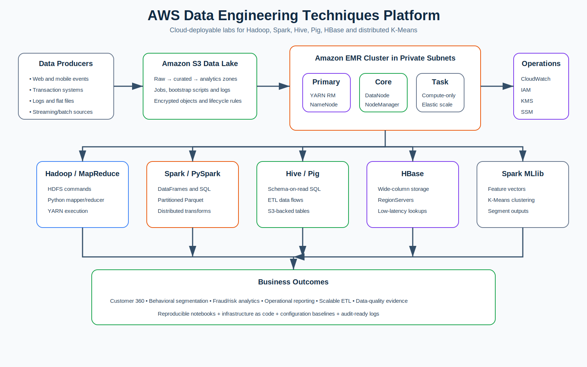

# Data Engineering Techniques

A consolidated, AWS-deployable data engineering laboratory covering:

- Hadoop HDFS and MapReduce
- Apache Spark and PySpark
- Hive data warehousing
- Apache Pig ETL
- HBase NoSQL
- K-Means clustering on Spark
- EMR cluster orchestration
- Master/core/task-node networking
- S3 data lake storage
- IAM, CloudWatch, encryption, and reproducible configuration

All notebooks contain executable Python commands. Screenshots are optional evidence, not the primary lab mechanism.

## Business case study

A national retailer receives customer interaction and transaction events from web, mobile, stores, and support systems. The platform must:

1. Ingest and retain raw events.
2. Run batch transformations at scale.
3. Create queryable analytical tables.
4. Support low-latency customer lookups.
5. Segment customers using distributed K-Means.
6. Monitor execution, cost, and data quality.

## Architecture



## Repository structure

```text
data-engineering-techniques/
├── notebooks/
│   ├── 00_aws_emr_orchestration.ipynb
│   ├── 01_hadoop_mapreduce.ipynb
│   ├── 02_spark_etl.ipynb
│   ├── 03_hive_warehouse.ipynb
│   ├── 04_pig_etl.ipynb
│   ├── 05_hbase_nosql.ipynb
│   └── 06_spark_kmeans.ipynb
├── infra/
│   ├── cdk/
│   └── emr-configurations/
├── jobs/
│   ├── hadoop/
│   ├── spark/
│   ├── hive/
│   ├── pig/
│   ├── hbase/
│   └── kmeans/
├── scripts/
│   ├── bootstrap/
│   └── orchestration/
├── data/sample/
├── docs/
├── tests/
└── .github/workflows/
```

## Deployment modes

### Local validation

```bash
python -m venv .venv
source .venv/bin/activate
pip install -r requirements-dev.txt
pytest
jupyter lab
```

The notebooks default to `DRY_RUN=true`, so AWS commands are printed and validated without creating resources.

### AWS deployment

```bash
export AWS_REGION=us-east-1
export DATA_BUCKET_NAME=<globally-unique-bucket-name>
cd infra/cdk
pip install -r requirements.txt
cdk bootstrap
cdk deploy
```

Upload data and jobs:

```bash
python scripts/orchestration/upload_assets.py   --bucket "$DATA_BUCKET_NAME"
```

Create the EMR cluster:

```bash
python scripts/orchestration/create_emr_cluster.py   --bucket "$DATA_BUCKET_NAME"   --subnet-id <private-subnet-id>   --service-role EMR_DefaultRole   --instance-profile EMR_EC2_DefaultRole
```

## Security defaults

- Private subnets for EMR nodes
- S3 server-side encryption
- IAM least privilege
- CloudWatch logs
- No public SSH requirement; use AWS Systems Manager where available
- Configurable termination protection and auto-termination
- No credentials committed to source control

## Legacy repositories to archive after verification

- `Data-Engineering-Lab-1--Hadoop-Mapreduce`
- `Data-Engineering-Lab--Apache-Spark`
- `Data-Engineering-Lab--Hive`
- `Data-Engineering-Lab--Pig`
- `Data-Engineering-Lab--HBase`
- `Data-Engineering-Lab--K-Means-Clustering-on-Spark`

See `docs/MIGRATION_AND_ARCHIVE.md`.
